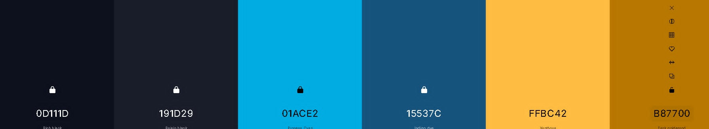
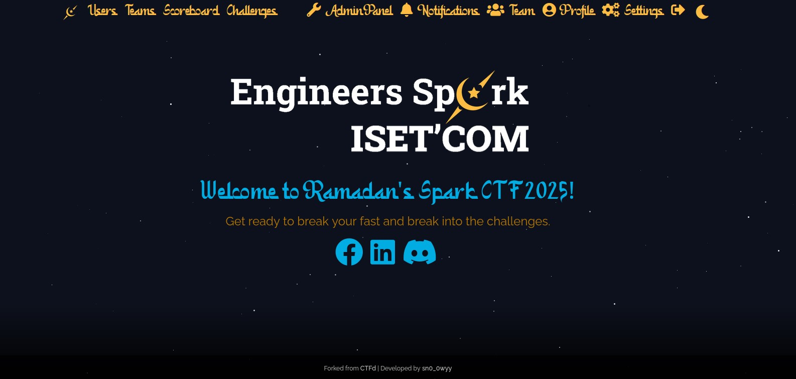
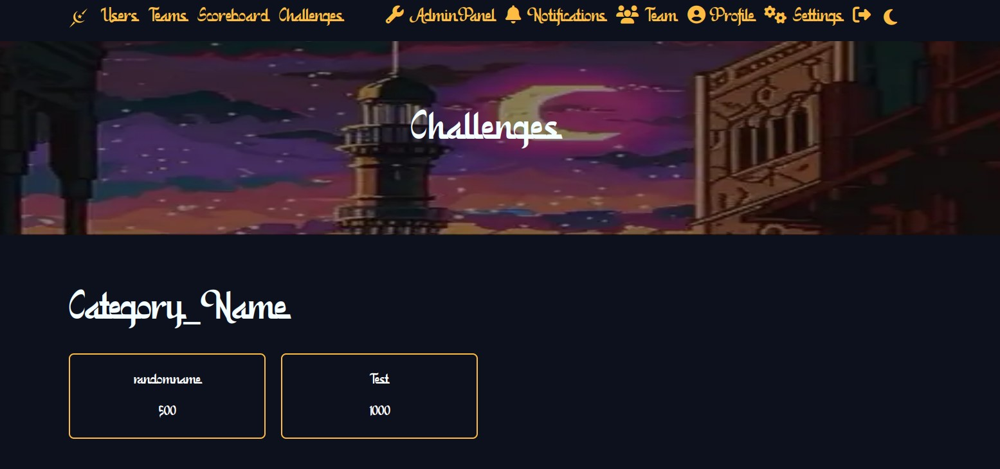
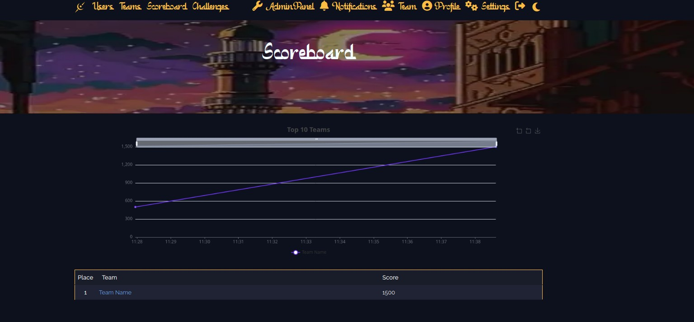
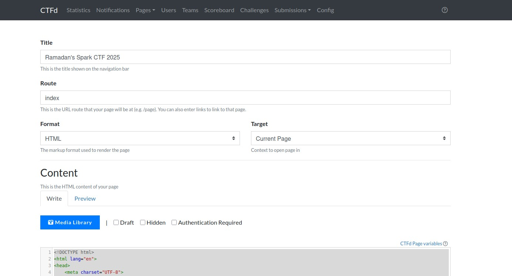

# Ramadhan's Spark CTF 2025 - Theme Deployment

## Overview
This repository contains the theme for **Ramadhan's Spark CTF 2025**. The theme includes styling, assets, and configurations necessary for setting up the event's front-end and branding.

Our media manager (0xGrayaa) suggested this palette for the platform.  

  


We'll be using the font [Kamali](https://www.1001fonts.com/kamali-font.html) through the .ttf file.  


### Main Page

### Challenges

### Scoreboard



## Deployment Instructions


### Prerequisites
Ensure you have the following installed:
- Node.js (v16+ recommended)
- npm
- Git

### Steps to Deploy

> Supposedly you have the default CTFd files from their official git repo [CTFd](https://github.com/CTFd/CTFd).
  
1. Clone the repository:
   ```bash
   git clone git@github.com:sn0-0wyy/Ramadan-Spark-s-CTF-2025.git
   cd Ramadan-Spark-s-CTF-2025
   ```
2. Add the theme to the /CTFd/themes .
3. docker compose your CTFd up .
4. Open Admin Panel --> Config --> Themes --> Choose the Ramadan's theme and Press update at the bottom.
5. Now we have to add our necessary files (font,banner,logo...)
6. Config --> Pages --> index
   
```html
<!DOCTYPE html>
<html lang="en">
  <head>
    <meta charset="UTF-8">
    <meta name="viewport" content="width=device-width, initial-scale=1.0">
    <title>Ramadan CTF</title>
    <link rel="stylesheet" href="https://cdnjs.cloudflare.com/ajax/libs/font-awesome/5.15.4/css/all.min.css">
    <style>
      * {
        margin: 0;
        padding: 0;
        box-sizing: border-box;
      }

      body {
        font-family: Arial, sans-serif;
        background-color: #0D111D;
        color: #FFBC42;
        display: flex;
        justify-content: center;
        align-items: center;
        min-height: 100vh;
        overflow: auto;
        text-align: center;
        position: relative;
      }

      body::after {
        content: '';
        position: fixed;
        bottom: 0;
        left: 0;
        width: 100%;
        height: 20%;
        background: linear-gradient(to top, rgba(0, 0, 0, 1), rgba(0, 0, 0, 0));
        z-index: 1;
      }

      .container {
        position: relative;
        z-index: 2;
      }

      h1 {
        color: #01ACE2;
        font-size: 3rem;
        margin-top: 20px;
        animation: fadeIn 2s ease-in-out;
      }

      p {
        color: #B87700;
        font-size: 1.5rem;
        animation: fadeIn 3s ease-in-out;
      }

      .banner {
        width: 100%;
        max-width: 800px;
        height: auto;
        margin: -100px auto;
        animation: float 4s ease-in-out infinite;
      }

      .stars {
        position: fixed;
        top: 0;
        left: 0;
        width: 100%;
        height: 100%;
        overflow: hidden;
        z-index: -1;
      }

      .stars span {
        position: absolute;
        background: white;
        border-radius: 50%;
        animation: twinkle linear infinite;
      }

      .fa-facebook,
      .fa-linkedin,
      .fa-discord {
        color: #01ACE2;
      }

      @keyframes float {

        0%,
        100% {
          transform: translateY(0);
        }

        50% {
          transform: translateY(-10px);
        }
      }

      @keyframes fadeIn {
        0% {
          opacity: 0;
        }

        100% {
          opacity: 1;
        }
      }

      @keyframes twinkle {
        0% {
          opacity: 0;
          transform: scale(0);
        }

        50% {
          opacity: 1;
          transform: scale(1);
        }

        100% {
          opacity: 0;
          transform: scale(0);
        }
      }
    </style>
  </head>
  <body>
    <div class="container">
      
      <h1 style="font-family:'Kamali'">Welcome to Ramadan's Spark CTF 2025!</h1>
      <p>Get ready to break your fast and break into the challenges.</p>
      <h3 class="text-center">
        <a href="https://www.facebook.com/engineers.spark" target="_blank">
          <i class="fab fa-facebook fa-2x" aria-hidden="true"></i>
        </a>&nbsp; <a href="https://www.linkedin.com/company/engineers-spark-iset-com" target="_blank">
          <i class="fab fa-linkedin fa-2x" aria-hidden="true"></i>
        </a>&nbsp; <a href="https://discord.gg/FFcmSFmKmr" target="_blank">
          <i class="fab fa-discord fa-2x" aria-hidden="true"></i>
        </a>&nbsp;
      </h3>
      <div class="stars"></div>
    </div>
    <script>
      function createStars() {
        const starsContainer = document.querySelector('.stars');
        const starCount = 200;
        for (let i = 0; i < starCount; i++) {
          const star = document.createElement('span');
          star.style.left = `${Math.random() * 100}%`;
          star.style.top = `${Math.random() * 100}%`;
          star.style.width = `${Math.random() * 3}px`;
          star.style.height = star.style.width;
          star.style.animationDuration = `${Math.random() * 3 + 2}s`;
          star.style.animationDelay = `${Math.random() * 2}s`;
          starsContainer.appendChild(star);
        }
      }
      createStars();
    </script>
  </body>
</html>
```


7. Inside the **Media Library** add your files they will now have a link inside of your platform.
  


8. Load our css inside the Config --> Theme --> Theme Header.  

```css
<style id="theme-color">
:root {--theme-color: #0d111d;}
.navbar {background-color: var(--theme-color) !important;}
.jumbotron {background-color: var(--theme-color) !important;}
.nav-link.dropdown-toggle {display:none;}
.footer {
    position: fixed;
    bottom: 0;
    width: 100%;
    height: 50px;
    line-height: 50px;
    background: rgba(0, 0, 0, 0.8);
    color: #cccccc;
    text-align: center;
    font-size: 14px;
    z-index: 10;
    display: flex;
    justify-content: center;
    align-items: center;
    padding: 5px 0;
}
.navbar .nav-link {color: #ffbc42;}
.jumbotron {
    background: url('/files/c1a768da79a39b301bf268b523c53e98/background.jpg') no-repeat center center;
    background-size: 100% 100%;
    padding: 120px 0px;
}
.navbar .nav-link {font-size: 28px;}
.ctf_logo {width: 30px; height: 30px; object-fit: contain;}
#team-id {
    font-family: 'Kamali', sans-serif;
    font-size: 60px !important;
}
@font-face {
    font-family: 'Kamali';
    src: url('/files/e7c7dac562c6690972ed473643e577d1/Kamali.ttf') format('truetype');
    font-weight: normal;
    font-style: normal;
}
.challenge-inner {font-family: 'Kamali'; font-size: 23px;}
body {background: #0D111D; color: #F4FDFF;}
.modal-body {background: #0D111D;}
.nav-link {background: #0D111D;}
.table thead {color: white;}
.table {
    background-color: #0D111D;
    color: #F4FDFF;
    th, td {background-color: inherit;}
}
</style>

```


Now the Theme should be ready!!


## Encountered Errors & Fixes


### 2. Build Failures
  -The static folder must contain `manifest.json` .So If you run `npm run build` to compile your scss modifications this will create that `manifest.json` inside the 
    static/.vite/ so you need to copy it a directory behind. `cp /static/.vite/manifest.json /static/` 


## Special Thanks
A huge thank you to the **Engineers Spark**  for making this event possible. Also, shoutout to all contributors who helped shape this project!


